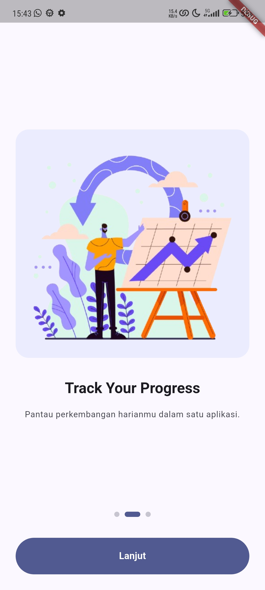
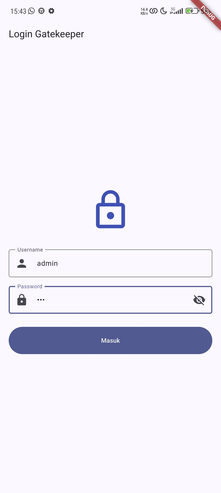
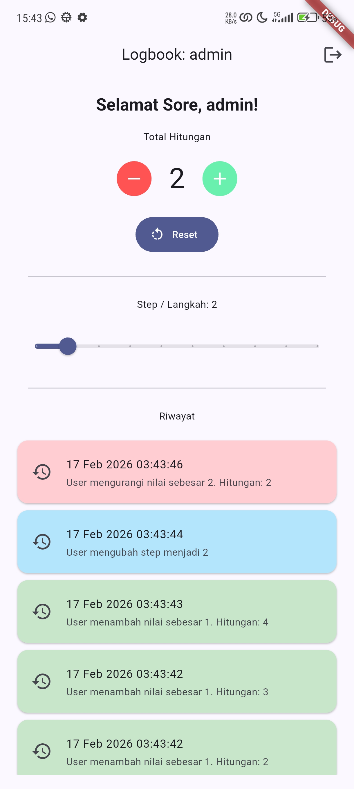
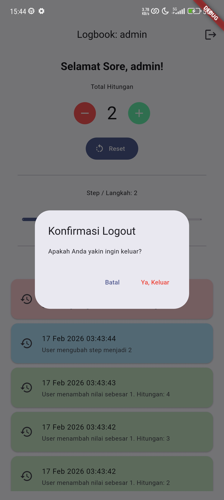

# Logbook App - Modul 2

Aplikasi pencatatan aktivitas harian dengan fitur Autentikasi dan Onboarding, dikembangkan menggunakan Flutter dengan penerapan Clean Architecture.

## Fitur Utama

- **Onboarding**: Antarmuka pengenalan aplikasi dengan 3 langkah visual indikator halaman.
- **Authentication**: Sistem login dengan multi-user (`admin`, `satriadi`, `user`), validasi input, toggle show/hide password, dan mekanisme lockout (kunci sementara) setelah gagal login 3 kali.
- **Logbook**: Pencatatan counter dan riwayat aktivitas yang persisten (tersimpan meski aplikasi ditutup) menggunakan `Shared Preferences`.
- **User-Specific Persistence**: Data setiap pengguna disimpan secara terisolasi, sehingga `admin` dan `user` memiliki catatan masing-masing.
- **UX Enhancements**: Banner selamat datang yang menyesuaikan waktu (Pagi/Siang/Sore/Malam) dan dialog konfirmasi logout yang aman.

## Screenshots

|                      Onboarding                       |                    Login                    |                Counter & Banner                 |                 Logout Dialog                 |
| :---------------------------------------------------: | :-----------------------------------------: | :---------------------------------------------: | :-------------------------------------------: |
|  |  |  |  |

## Lesson Learned (Refleksi Akhir)

1. **Konsep Baru**: Memahami mendalam tentang `Shared Preferences` untuk persistensi data lokal dan pentingnya `Key` yang unik (misal: `counter_$username`) untuk memisahkan data antar pengguna yang berbeda dalam satu perangkat.
2. **Kemenangan Kecil**: Berhasil mengimplementasikan logika keamanan "Lockout" pada `LoginController` yang menggunakan `Timer` untuk menonaktifkan tombol login selama 10 detik, memberikan pengalaman keamanan yang nyata. Juga berhasil membuat tampilan lebih personal dengan "Welcome Banner" berbasis waktu.
3. **Target Berikutnya**: Saya ingin mempelajari bagaimana mengelola state yang lebih kompleks menggunakan state management solution seperti Provider atau Bloc, dan menyimpan data yang lebih terstruktur menggunakan database lokal seperti SQLite atau Hive.
