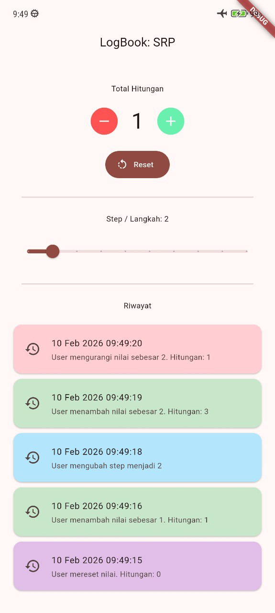

# logbook_app_080

| Refleksi                                                                                                                                                                                                                                                                                            | Screenshot                                          |
| :-------------------------------------------------------------------------------------------------------------------------------------------------------------------------------------------------------------------------------------------------------------------------------------------------- | :-------------------------------------------------- |
| 1. **Konsep Baru**: Membuat widget scrollable dan tidak overflow menggunakan ListView, Expanded, dan Column   2. **Kemenangan Kecil**: Bisa menyimpan data waktu, pesan log, dan color secara bersamaan dengan tipe Record   3. **Target Berikutnya**: Ingin tahu caranya agar data persisten |  |
