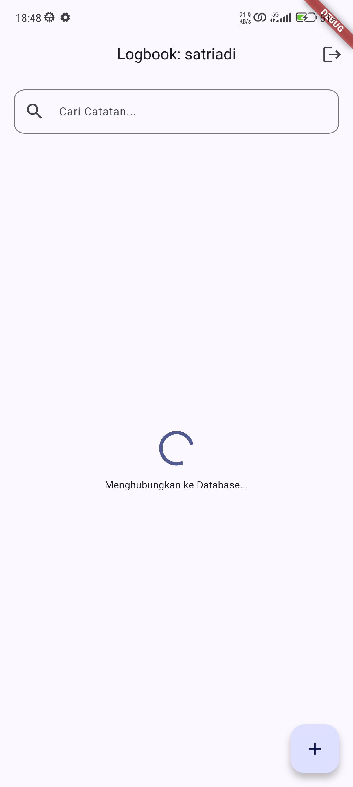
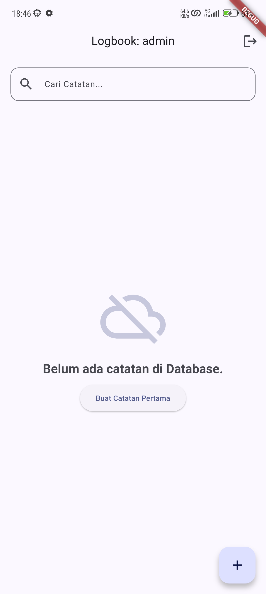
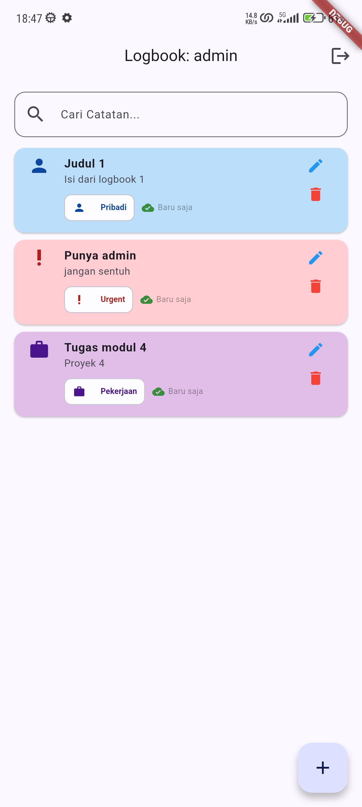
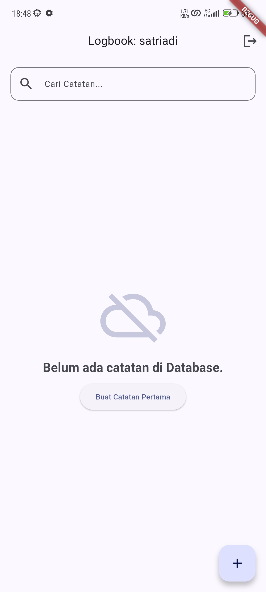
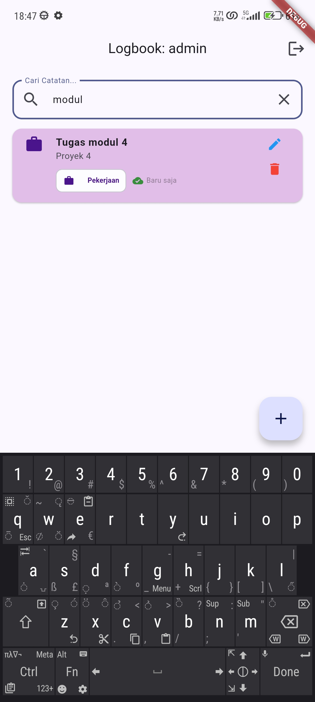

# Logbook App - Modul 4

Aplikasi Logbook Digital dengan fitur CRUD berbasis cloud database (MongoDB), dikembangkan menggunakan Flutter dengan penerapan prinsip SOLID, Singleton Pattern, dan Asynchronous Programming.

## Fitur Utama

- **Onboarding**: Antarmuka pengenalan aplikasi dengan 3 langkah dan indikator halaman.
- **Authentication**: Sistem login multi-user dengan validasi input, toggle visibilitas password, dan mekanisme lockout setelah 3x gagal login.
- **Reactive Programming**: Manajemen state menggunakan `ValueNotifier` dan `ValueListenableBuilder` sehingga UI terupdate otomatis tanpa `setState` berlebih.
- **Async-Reactive Flow**: Loading indicator saat koneksi ke database, penanganan error koneksi, dan empty state yang informatif.
- **Timestamp Formatting**: Format waktu relatif ("2 menit yang lalu", "3 jam yang lalu", "25 Jan 2026") menggunakan logika waktu lokal Indonesia.
- **Search**: Pencarian catatan secara real-time berdasarkan judul dan deskripsi.
- **Kategori**: Sistem kategori (Pribadi, Pekerjaan, Urgent) dengan warna dan ikon yang berbeda, terpusat di `AppConstants`.
- **[NEW] Cloud CRUD**: Pencatatan aktivitas dengan fitur Tambah, Edit, dan Hapus yang tersinkronisasi langsung ke database MongoDB.
- **[NEW] Connection Guard**: Pesan error melalui SnackBar jika koneksi ke database gagal saat aplikasi dimulai.
- **[NEW] Secure Credentials**: Penyimpanan kredensial database di file `.env` yang terlindungi oleh `.gitignore`.
- **[NEW] Pull-to-Refresh**: Widget `RefreshIndicator` untuk memperbarui data dari database secara manual.
- **[NEW] Cloud Sync Indicator**: Ikon cloud pada setiap item yang menunjukkan data tersinkronisasi dengan server.
- **[NEW] Per-User Log Filtering**: Setiap log ditandai dengan `username` pemiliknya. Saat fetch, hanya data milik user yang sedang login yang ditampilkan.
- **[NEW] Audit Logging**: Sistem `LogHelper` dengan level verbosity (`LOG_LEVEL`) dan source filtering (`LOG_MUTE`) yang dikonfigurasi melalui `.env`. Log juga ditulis ke file harian `dd-MM-yyyy.log`.

## Screenshots

### Modul 4

|                           Loading State                           |                          Log Kosong                           |                         List Log                          |
| :---------------------------------------------------------------: | :-----------------------------------------------------------: | :-------------------------------------------------------: |
|  |  |  |
|                        **Log Kosong (2)**                         |                        **Search Log**                         |                                                           |
|  |  |                                                           |

## Lesson Learned (Refleksi Akhir)

1. **Konsep Baru**:
   - Memahami cara kerja Singleton Pattern dalam konteks koneksi database: hanya ada satu instance `MongoService` yang aktif sepanjang lifecycle aplikasi, sehingga koneksi tidak dibuka berulang kali. Selain itu, baru memahami bahwa `ObjectId` di MongoDB berbeda dengan auto-increment di SQL, nilainya dibuat di sisi klien sebelum data dikirim ke server, bukan oleh server itu sendiri.
2. **Kemenangan Kecil**:
   - Berhasil menghubungkan aplikasi Flutter ke MongoDB lokal yang berjalan di Docker, kemudian mengekspos port-nya ke internet menggunakan ngrok sebagai pengganti MongoDB Atlas. Pendekatan ini berguna untuk pengujian tanpa biaya dan tanpa ketergantungan pada layanan cloud pihak ketiga.
   - Prinsip Separation of Concerns terbukti efektif: perpindahan dari penyimpanan lokal (SharedPreferences) ke database remote hanya membutuhkan perubahan di lapisan Service dan Controller, sedangkan View hampir tidak berubah.
3. **Target Berikutnya**:
   - Ingin mengimplementasikan fitur *offline-first*, yaitu data tetap bisa ditambah dan dilihat meskipun tidak ada koneksi internet, kemudian disinkronkan ke server saat koneksi kembali tersedia.
