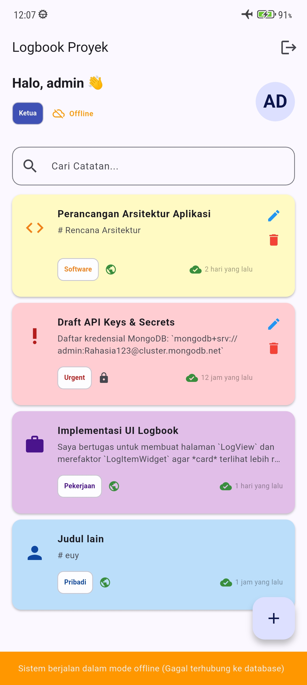
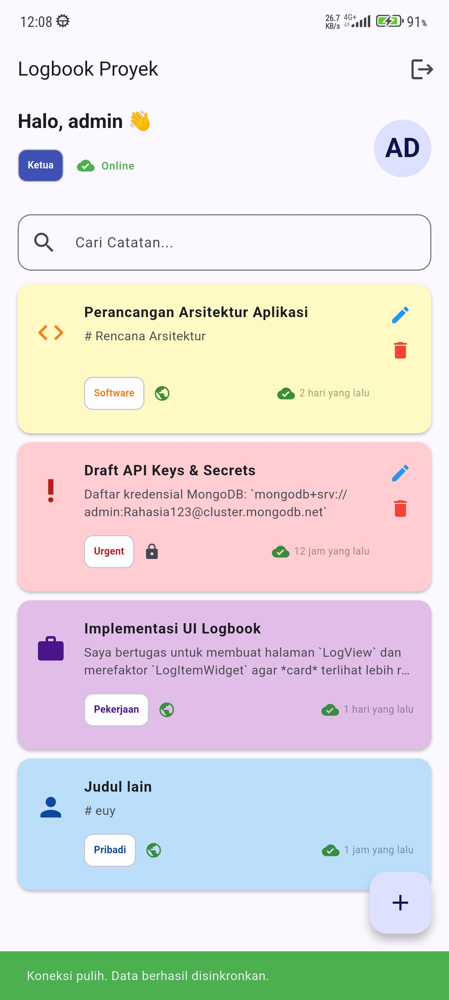
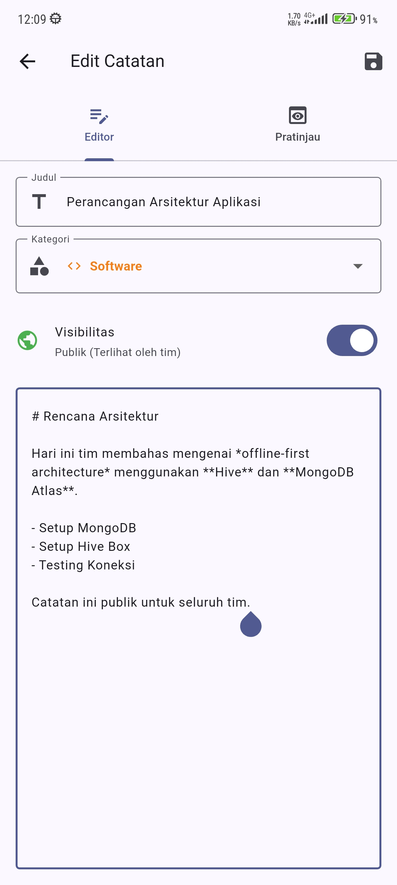
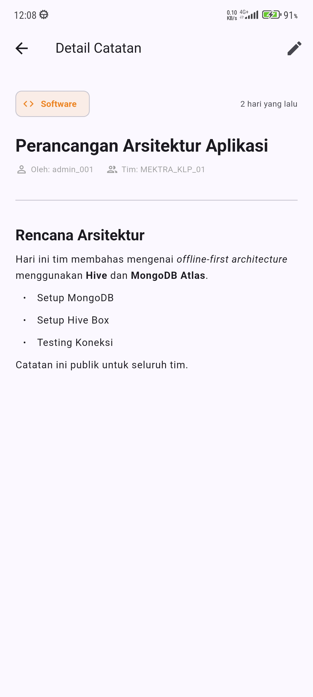
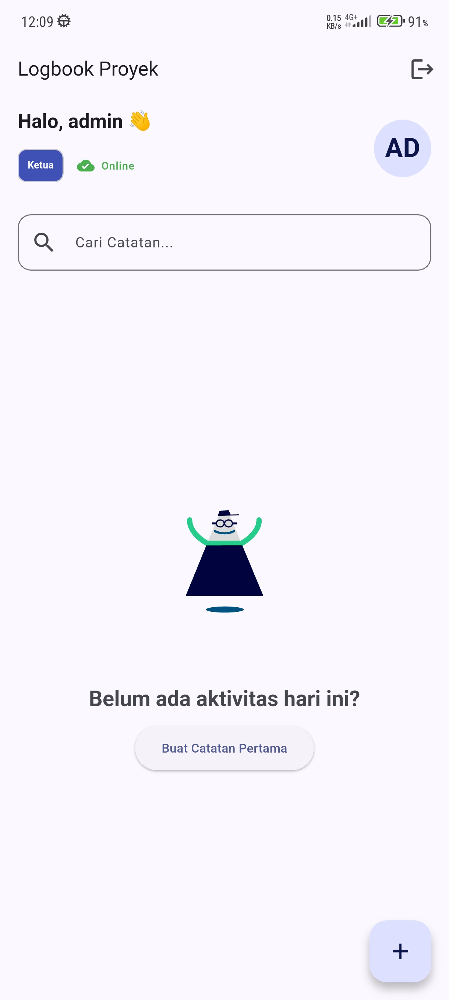

# Logbook App - Modul 5

Aplikasi Logbook Digital dengan fitur CRUD berbasis cloud database (MongoDB), dikembangkan menggunakan Flutter dengan penerapan prinsip SOLID, Singleton Pattern, dan Asynchronous Programming.

## Fitur Utama

- **Onboarding**: Antarmuka pengenalan aplikasi dengan 3 langkah dan indikator halaman.
- **Authentication**: Sistem login multi-user dengan validasi input, toggle visibilitas password, dan mekanisme lockout setelah 3x gagal login.
- **Reactive Programming**: Manajemen state menggunakan `ValueNotifier` dan `ValueListenableBuilder` sehingga UI terupdate otomatis tanpa `setState` berlebih.
- **Async-Reactive Flow**: Loading indicator saat koneksi ke database, penanganan error koneksi, dan empty state yang informatif.
- **Timestamp Formatting**: Format waktu relatif ("2 menit yang lalu", "3 jam yang lalu", "25 Jan 2026") menggunakan logika waktu lokal Indonesia.
- **Search**: Pencarian catatan secara real-time berdasarkan judul dan deskripsi.
- **Kategori**: Sistem kategori (Pribadi, Pekerjaan, Urgent) dengan warna dan ikon yang berbeda, terpusat di `AppConstants`.
- **Cloud CRUD**: Pencatatan aktivitas dengan fitur Tambah, Edit, dan Hapus yang tersinkronisasi langsung ke database MongoDB.
- **Connection Guard**: Pesan error melalui SnackBar jika koneksi ke database gagal saat aplikasi dimulai.
- **Secure Credentials**: Penyimpanan kredensial database di file `.env` yang terlindungi oleh `.gitignore`.
- **Pull-to-Refresh**: Widget `RefreshIndicator` untuk memperbarui data dari database secara manual.
- **Cloud Sync Indicator**: Ikon cloud pada setiap item yang menunjukkan data tersinkronisasi dengan server.
- **Per-User Log Filtering**: Setiap log ditandai dengan `username` pemiliknya. Saat fetch, hanya data milik user yang sedang login yang ditampilkan.
- **Audit Logging**: Sistem `LogHelper` dengan level verbosity (`LOG_LEVEL`) dan source filtering (`LOG_MUTE`) yang dikonfigurasi melalui `.env`. Log juga ditulis ke file harian `dd-MM-yyyy.log`.
- **[NEW] Offline-First (Hive)**: Penyimpanan data biner secara lokal agar log tetap tersedia instan tanpa koneksi internet.
- **[NEW] Hybrid Sync Manager**: Sinkronisasi cerdas antara database lokal dan MongoDB Atlas secara *background*.
- **[NEW] RBAC Gatekeeper**: Validasi keamanan level UI dan Controller berdasarkan *role* (Ketua/Anggota) dan *ownership* (pemilik data).
- **[NEW] Collaborative Team Isolation**: Pemisahan data *(multi-tenancy)* menggunakan filter `teamId` agar kelompok mahasiswa dapat bekerja secara kolaboratif.
- **[NEW] Markdown Editor**: Pengolahan dan formatting dokumen laporan kaya (*rich-text*) dengan tab khusus Editor & Preview menggunakan `flutter_markdown`.
- **[NEW] Data Sovereignty & Privacy Badge**: Sistem catatan privat *(Private)* dan publik *(Public)* yang membatasi hak akses kerahasiaan antar rekan satu tim secara absolut di level Cloud Database.
- **[NEW] Connectivity Awareness**: Menampilkan *dashboard header* indikator status sinyal (Offline/Online) *real-time* berbasis paket `connectivity_plus`.

## Screenshots

|                            Offline List (Hive)                            |                         Back to Online                          |                         Form Editor (Markdown)                          |
| :-----------------------------------------------------------------------: | :-------------------------------------------------------------: | :---------------------------------------------------------------------: |
|               |    |  |
|                           **Markdown Preview**                            |                         **Empty State**                         |                                                                         |
|  |  |                                                                         |

## Lesson Learned (Refleksi Akhir)

1. **Konsep Baru**:
   - Mempelajari implementasi arsitektur *Offline-First* pada aplikasi Flutter menggunakan basis data lokal Hive yang disinkronisasikan ke MongoDB Atlas. Penggunaan model data biner dan *Adapter Generator* dari Hive memungkinkan proses baca-tulis data terjadi secara instan di memori perangkat, sehingga antarmuka pengguna (UI) tetap responsif dan tidak bergantung pada latensi jaringan server.
2. **Kemenangan Kecil**:
   - Berhasil mengimplementasikan sistem *Security Gatekeeper* dan kontrol *Data Privacy* (*Private/Public Notes*) yang mencegah kebocoran data antar anggota tim. Kesulitan dalam menyaring data berhasil diatasi dengan menerapkan *filter* langsung pada *query* koleksi MongoDB (*server-side filtering*). Selain itu, *bug* asinkron terkait ketidaksesuaian *index* saat menghapus data dengan filter pencarian aktif telah diselesaikan dengan memvalidasi ulang posisi data menggunakan kombinasi tiga parameter (*Timestamp, AuthorId, Title*) pada metode `.indexWhere()`.
3. **Target Berikutnya**:
   - Menghilangkan *hardcode* pada data pengguna dengan membuat *collection* khusus "users" di MongoDB. Selanjutnya, saya berencana untuk membangun fitur *Registration* serta antarmuka Manajemen Tim untuk mempermudah alokasi kolaborasi proyek.
